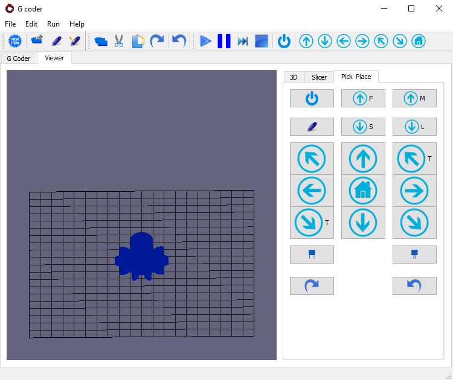

# 3DPrinterAssembler
Recent interest in additive manufacturing (AM) technologies (also known as 3D printing) has led to embedding multi-material and electronic components into 3D-printed structures. However, current 3D printing technologies fail to provide all the required materials to fabricate complex devices. Besides, the process of inserting individual building blocks into the impression is usually carried out manually. This paper presents the design of a robot that integrates 3D printing and automated assembly. The robot utilises two modules. The first module fabricates the body of a device by using fused deposition modelling (FDM) technology. The second module grasps pre-assembled building blocks and inserts them into the device. To this end, the feasibility of this integration is validated with the fabrication of a device (non-fabricable with traditional 3D printers) that contains a development board.  

# Requirements

The current version of the software runs on Python 2.7. The firmware of the microcontrollers PIC16F was coded using CCS, and the circuit schematics and PCB designs are only compatible with Proteus 8. 

